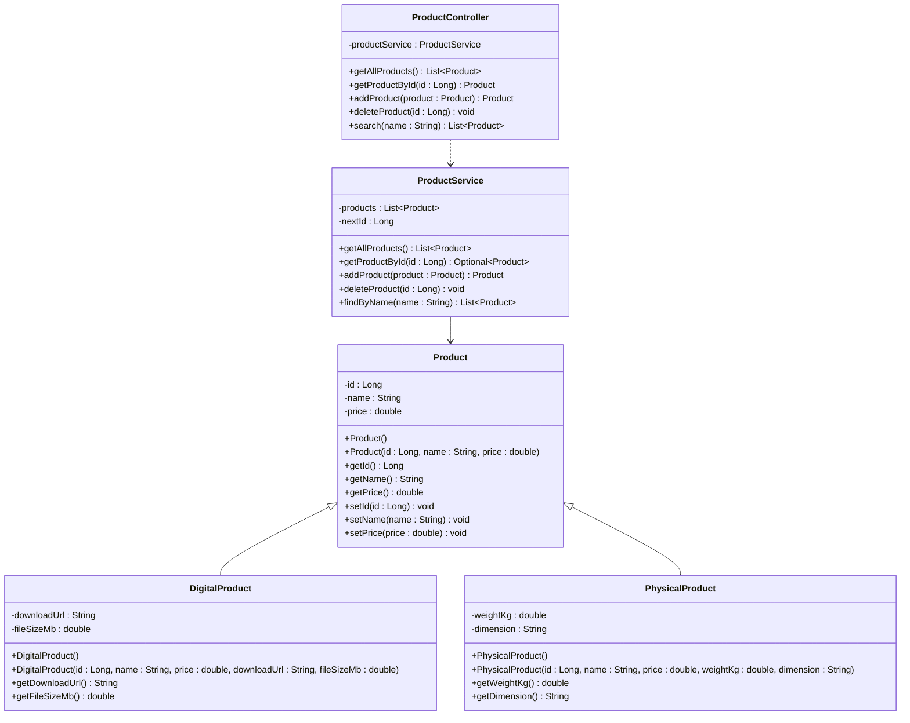

```mermaid
classDiagram
    class Product {
        -id : Long
        -name : String
        -price : double
        +Product()
        +Product(id : Long, name : String, price : double)
        +getId() Long
        +getName() String
        +getPrice() double
        +setId(id : Long) void
        +setName(name : String) void
        +setPrice(price : double) void
    }

    class DigitalProduct {
        -downloadUrl : String
        -fileSizeMb : double
        +DigitalProduct()
        +DigitalProduct(id : Long, name : String, price : double, downloadUrl : String, fileSizeMb : double)
        +getDownloadUrl() String
        +getFileSizeMb() double
    }

    class PhysicalProduct {
        -weightKg : double
        -dimension : String
        +PhysicalProduct()
        +PhysicalProduct(id : Long, name : String, price : double, weightKg : double, dimension : String)
        +getWeightKg() double
        +getDimension() String
    }

    class ProductService {
        -products : List~Product~
        -nextId : Long
        +getAllProducts() List~Product~
        +getProductById(id : Long) Optional~Product~
        +addProduct(product : Product) Product
        +deleteProduct(id : Long) void
        +findByName(name : String) List~Product~
    }

    class ProductController {
        -productService : ProductService
        +getAllProducts() List~Product~
        +getProductById(id : Long) Product
        +addProduct(product : Product) Product
        +deleteProduct(id : Long) void
        +search(name : String) List~Product~
    }

    Product <|-- DigitalProduct
    Product <|-- PhysicalProduct
    ProductController ..> ProductService
    ProductService --> Product
```
