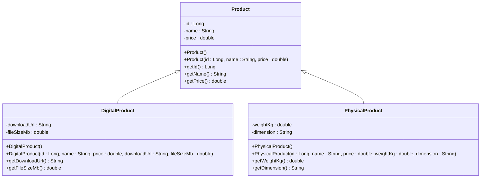

```mermaid
classDiagram
    class Product {
        -id : Long
        -name : String
        -price : double
        +Product()
        +Product(id : Long, name : String, price : double)
        +getId() Long
        +getName() String
        +getPrice() double
    }

    class DigitalProduct {
        -downloadUrl : String
        -fileSizeMb : double
        +DigitalProduct()
        +DigitalProduct(id : Long, name : String, price : double, downloadUrl : String, fileSizeMb : double)
        +getDownloadUrl() String
        +getFileSizeMb() double
    }

    class PhysicalProduct {
        -weightKg : double
        -dimension : String
        +PhysicalProduct()
        +PhysicalProduct(id : Long, name : String, price : double, weightKg : double, dimension : String)
        +getWeightKg() double
        +getDimension() String
    }

    Product <|-- DigitalProduct
    Product <|-- PhysicalProduct
```
